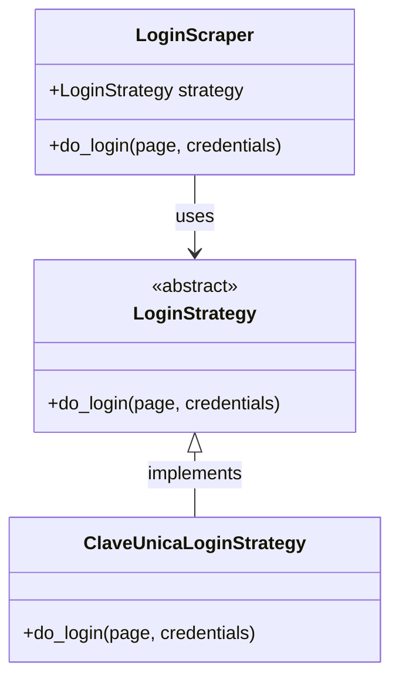
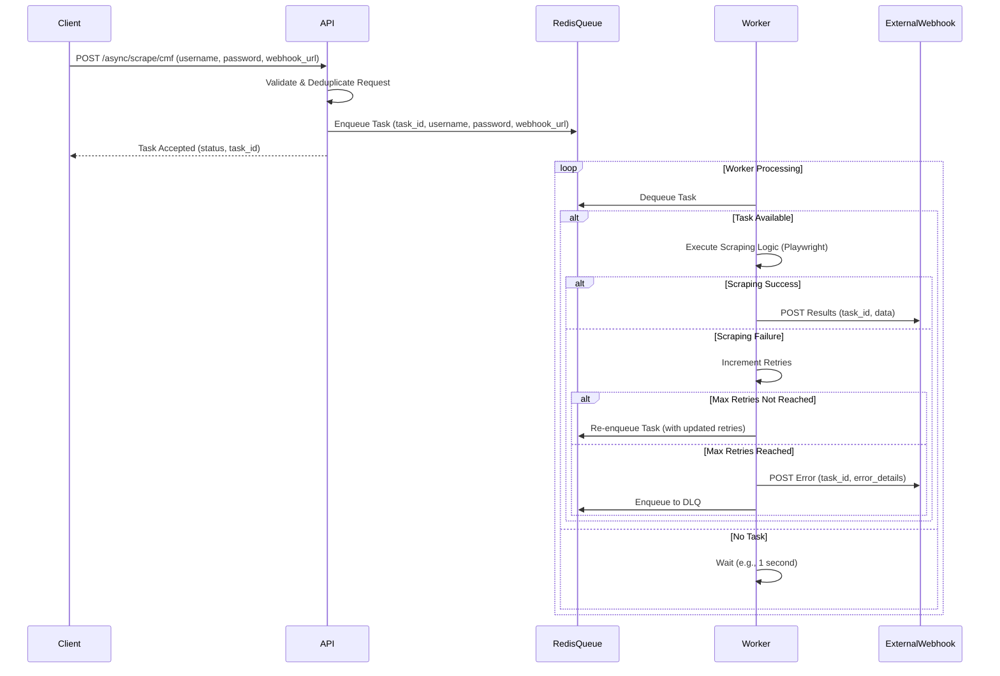

## 📌 Uso previsto y advertencia legal (ES)

**Clave Única NO OFICIAL API** es un proyecto de código abierto desarrollado con fines **educativos, personales y de investigación técnica**. Está diseñado para que cualquier persona pueda automatizar, de forma local, el acceso a sus propios datos disponibles en plataformas oficiales del Estado chileno como CMF, AFC o SII, **sin intermediarios, sin almacenar claves y sin compartirlas con terceros**.

### ❗ Este proyecto **NO** debe utilizarse para:

- Proporcionar servicios comerciales a terceros.
- Automatizar accesos a cuentas que no sean del propio usuario.
- Recolectar, almacenar o distribuir credenciales de Clave Única.
- Integrarse como backend o API pública sin consentimiento informado, validación legal ni autorización estatal.

### ⚖️ Consideraciones legales:

- La **Clave Única** es una credencial **personal e intransferible**, administrada por el Estado de Chile.
- El autor **no se responsabiliza** por el mal uso del software ni por implementaciones que violen la ley o los términos de uso de las plataformas involucradas.

### ✅ Recomendación:

Usa este software únicamente bajo tu propio riesgo, con pleno conocimiento de su funcionamiento (audita el código) y exclusivamente en un entorno local y privado, para acceder a información **de la que tú seas titular**.

# Clave Unica API

This project aims to provide an API for various services related to "Clave Unica" (Unique Key) in Chile, leveraging web scraping techniques to gather information from official sources. It features a modular and extensible architecture to support various data sources.

## Features

- **Common Scraper Interface**: Introduces a `BaseScraper` abstract class, ensuring a consistent interface (`run()` method) for all scrapers. This promotes modularity and simplifies integration.
- **CMF Scraper**: Fetches data from the CMF (Comisión para el Mercado Financiero) using a user's RUT (Chilean national identification number) and password. Now inherits from `BaseScraper`.
- **AFC Scraper**: Extracts "empresas" (companies) and "cotizaciones" (contributions) data from the AFC website. It handles reCAPTCHA solving and automatically scrapes data for the current year and the two previous years. Also inherits from `BaseScraper`.
- **SII Scraper**: Extracts tax data from the SII (Servicio de Impuestos Internos) website. Also inherits from `BaseScraper`.
- **Separation of Captcha Logic**: reCAPTCHA solving logic is extracted into a dedicated `RecaptchaSolver` class, improving modularity and testability.
- **Asynchronous Task Processing**: Implements a robust asynchronous system for scraping tasks, offloading heavy operations to background workers.
- **Redis-backed Queue & Deduplication**: Uses Redis for persistent task queuing and to prevent processing of duplicate requests within a defined timeframe.
- **Decoupled Workers**: Scraping tasks are processed by independent worker processes, enhancing scalability and fault tolerance.

### Login Strategy Pattern

To support various login methods for different services while maintaining a clean and extensible codebase, the project implements the Strategy design pattern for its login functionality. This approach decouples the login algorithm from the `LoginScraper` (context) that uses it.

**How it works:**

1.  **`LoginStrategy` (Abstract Strategy)**: An abstract base class defining the common interface for all login algorithms. It declares the `do_login` method that concrete strategies must implement.
2.  **`ClaveUnicaLoginStrategy` (Concrete Strategy)**: Implements the `LoginStrategy` interface, providing the specific login logic for the Clave Unica platform, including handling its unique selectors and error messages.
3.  **`LoginScraper` (Context)**: Holds a reference to a `LoginStrategy` object. It delegates the actual login process to the strategy object, allowing the `LoginScraper` to be independent of how the login is performed.

This design allows new login methods (e.g., for other government services or financial institutions) to be added by simply creating new concrete strategy classes without modifying existing code.



### Asynchronous Task Processing Architecture

To handle scraping tasks asynchronously and ensure scalability and fault tolerance, the system employs a message queue pattern with Redis. This decouples the API request from the actual scraping process.

**How it works:**

1.  **API (Producer)**: Receives asynchronous scraping requests, performs basic validation and deduplication, and then enqueues the task into Redis.
2.  **Redis Queue**: Acts as a reliable message broker, storing tasks until a worker is available. It also manages a Dead Letter Queue (DLQ) for tasks that fail after multiple retries.
3.  **Worker(s) (Consumer)**: Independent processes that continuously poll the Redis queue for new tasks. Upon receiving a task, a worker executes the scraping logic using Playwright.
4.  **Webhook Notification**: Once a task is completed (successfully or with final failure), the worker sends the results or error details to the `webhook_url` provided in the original request.

This architecture allows for horizontal scaling of workers, robust error handling with retries, and ensures that API responses are fast, as the heavy scraping operations are offloaded.



## Technologies Used

- **Python**: The core language for the project.
- **FastAPI**: For building the web API.
- **Uvicorn**: ASGI server for running the FastAPI application.
- **Playwright**: For headless browser automation and web scraping.
- **Redis**: Used for task queuing and deduplication.
- **Docker & Docker Compose**: For containerization and orchestration of services.
- **BeautifulSoup4**: For parsing HTML content.
- **python-dotenv**: For managing environment variables.
- **boto3**: AWS SDK for Python (suggests potential AWS integration).
- **pytest**: For testing.
- **ruff**: For code linting.
- **mypy**: For static type checking.

## Project Structure

```
clave_unica_api/
├── cli.py                  # Command-line interface for running scrapers
├── pyproject.toml          # Project metadata and dependencies
├── README.md               # This file
├── Dockerfile.api          # Dockerfile for the FastAPI application
├── Dockerfile.worker       # Dockerfile for the background worker
├── docker-compose.yml      # Docker Compose configuration for services
├── .env.example            # Example environment variables file
└── src/
    ├── __init__.py
    ├── config/             # Configuration files
    ├── dto/                # Data Transfer Objects
    │   ├── afc_data.py     # Data Transfer Objects for AFC Scraper
    │   └── cmf_data.py     # Data Transfer Objects for CMF Scraper
    ├── models/             # Data models (e.g., ClaveUnica, Task)
    ├── queue/              # Queue management (Redis, Deduplication)
    │   ├── __init__.py
    │   ├── models.py       # Task data model
    │   ├── queue_manager.py # Redis queue implementation
    │   └── deduplicator.py # Redis-based deduplication logic
    ├── scrapers/           # Web scraping modules
    │   ├── AFC_scraper.py  # AFC scraping logic
    │   ├── base_scraper.py # Abstract base class for all scrapers
    │   ├── captcha_solver.py # reCAPTCHA solving logic
    │   ├── CMF_scraper.py  # CMF scraping logic
    │   ├── SII_scraper.py  # SII scraping logic
    │   ├── login_scraper.py # Login context for various services
    │   └── login_strategies/ # Concrete login strategy implementations
    │       ├── __init__.py
    │       ├── base_strategy.py # Abstract base class for login strategies
    │       └── clave_unica_strategy.py # Clave Unica specific login strategy
    ├── utils/              # Utility functions (e.g., RUT validator)
    └── worker.py           # Background worker for processing tasks
```

## Installation

1.  **Clone the repository:**

    ```bash
    git clone https://github.com/luisbarradev/clave_unica_api.git
    cd clave_unica_api
    ```

2.  **Create a virtual environment (recommended):**

    ```bash
    python -m venv .venv
    source .venv/activate
    ```

3.  **Install dependencies using `uv`:**

    ```bash
    pip install uv # Install uv if you don't have it
    uv sync
    pip install -e . # Install project in editable mode
    ```

## Usage

### Running with Docker Compose (Recommended for Development & Production)

This project is designed to run using Docker Compose, which will set up Redis, the FastAPI API, and the background worker(s).

1.  **Ensure Docker is running** on your system.
2.  **Create a `.env` file** in the root of your project based on `.env.example` and configure your Redis connection details if not using the default local setup.

    ```bash
    cp .env.example .env
    # Edit .env if needed
    ```

3.  **Start the services:**

    ```bash
    docker-compose up --build
    ```

    This command will:

    - Build the Docker images for the API and worker.
    - Start a Redis container.
    - Start the FastAPI API service (accessible at `http://localhost:8000`).
    - Start one instance of the background worker (you can scale workers by uncommenting `replicas` in `docker-compose.yml`).

### Running Scrapers via CLI (Local Development)

To run the scrapers from the command line, use the `cli.py` script:

#### CMF Scraper

```bash
python cli.py cmf --username <YOUR_RUT> --password <YOUR_PASSWORD> [--headless]
```

- Replace `<YOUR_RUT>` with your Chilean RUT (without dots or hyphens).
- Replace `<YOUR_PASSWORD>` with your password.
- Use `--headless` to run the browser in headless mode (without a visible UI).

#### AFC Scraper

```bash
python cli.py afc --username <YOUR_RUT> --password <YOUR_PASSWORD> [--headless]
```

- Replace `<YOUR_RUT>` with your Chilean RUT (without dots or hyphens).
- Replace `<YOUR_PASSWORD>` with your password.
- Use `--headless` to run the browser in headless mode (without a visible UI).

### API Endpoints

The API will be available at `http://localhost:8000` (or the host configured in Docker Compose). You can access the interactive API documentation (Swagger UI) at `http://localhost:8000/docs` and the alternative ReDoc documentation at `http://localhost:8000/redoc`.

- **POST `/scrape/cmf`**: Scrapes CMF data synchronously using provided credentials.

  - **Request Body**:
    ```json
    {
      "username": "YOUR_RUT",
      "password": "YOUR_PASSWORD"
    }
    ```
  - **Example using `curl`**:
    ```bash
    curl -X POST "http://localhost:8000/scrape/cmf" \
         -H "Content-Type: application/json" \
         -d '{
               "username": "12345678-9",
               "password": "your_password"
             }'
    ```

- **POST `/async/scrape/cmf`**: Enqueues a CMF scraping task for asynchronous processing. Results will be sent to the provided `webhook_url`.

  - **Request Body**:
    ```json
    {
      "username": "YOUR_RUT",
      "password": "YOUR_PASSWORD",
      "webhook_url": "YOUR_WEBHOOK_URL"
    }
    ```
  - **Example using `curl`**:
    ```bash
    curl -X POST "http://localhost:8000/async/scrape/cmf" \
         -H "Content-Type: application/json" \
         -d '{
               "username": "12345678-9",
               "password": "your_password",
               "webhook_url": "https://your-callback-url.com/results"
             }'
    ```

- **POST `/scrape/afc`**: Scrapes AFC data synchronously using provided credentials.

  - **Request Body**:
    ```json
    {
      "username": "YOUR_RUT",
      "password": "YOUR_PASSWORD"
    }
    ```
  - **Example using `curl`**:
    ```bash
    curl -X POST "http://localhost:8000/scrape/afc" \
         -H "Content-Type: application/json" \
         -d '{
               "username": "12345678-9",
               "password": "your_password"
             }'
    ```

- **POST `/async/scrape/afc`**: Enqueues an AFC scraping task for asynchronous processing. Results will be sent to the provided `webhook_url`.

  - **Request Body**:
    ```json
    {
      "username": "YOUR_RUT",
      "password": "YOUR_PASSWORD",
      "webhook_url": "YOUR_WEBHOOK_URL"
    }
    ```
  - **Example using `curl`**:
    ```bash
    curl -X POST "http://localhost:8000/async/scrape/afc" \
         -H "Content-Type: application/json" \
         -d '{
               "username": "12345678-9",
               "password": "your_password",
               "webhook_url": "https://your-callback-url.com/results"
             }'
    ```

- **POST `/scrape/sii`**: Scrapes SII data synchronously using provided credentials.

  - **Request Body**:
    ```json
    {
      "username": "YOUR_RUT",
      "password": "YOUR_PASSWORD"
    }
    ```
  - **Example using `curl`**:
    ```bash
    curl -X POST "http://localhost:8000/scrape/sii" \
         -H "Content-Type: application/json" \
         -d '{
               "username": "12345678-9",
               "password": "your_password"
             }'
    ```

- **POST `/async/scrape/sii`**: Enqueues an SII scraping task for asynchronous processing. Results will be sent to the provided `webhook_url`.
  - **Request Body**:
    ```json
    {
      "username": "YOUR_RUT",
      "password": "YOUR_PASSWORD",
      "webhook_url": "YOUR_WEBHOOK_URL"
    }
    ```
  - **Example using `curl`**:
    ```bash
    curl -X POST "http://localhost:8000/async/scrape/sii" \
         -H "Content-Type: application/json" \
         -d '{
               "username": "12345678-9",
               "password": "your_password",
               "webhook_url": "https://your-callback-url.com/results"
             }'
    ```

## Development

### Running Tests

```bash
pytest
```

### Linting and Type Checking

```bash
ruff check .
mypy .
```

## Contributing

Contributions are welcome! Please open an issue or submit a pull request.

## License

This project is licensed under the GNU General Public License v3.0. See the [LICENSE](LICENSE) file for details.
