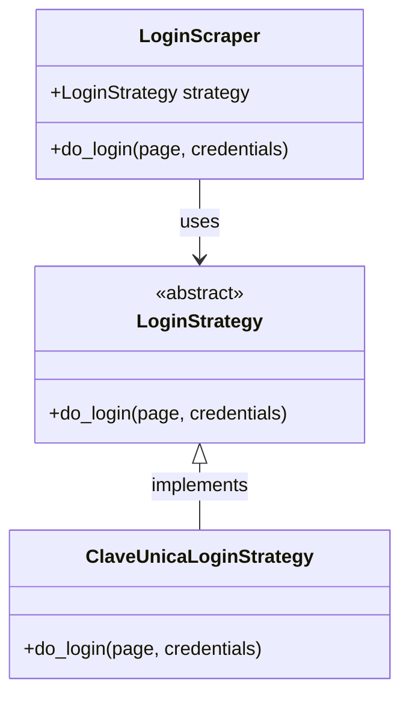

# Clave Unica API

This project aims to provide an API for various services related to "Clave Unica" (Unique Key) in Chile, starting with the CMF (Comisión para el Mercado Financiero) service. It leverages web scraping techniques to gather information from official sources.

## Features

- **CMF Scraper**: Currently implemented, this service allows fetching data from the CMF using a user's RUT (Chilean national identification number) and password.
- **Clave Unica Integration**: Designed to integrate with Chile's "Clave Unica" system for secure authentication.
- **Extensible Login System**: Utilizes the Strategy pattern for flexible and extensible login mechanisms, allowing easy addition of new login providers.

### Login Strategy Pattern

To support various login methods for different services while maintaining a clean and extensible codebase, the project implements the Strategy design pattern for its login functionality. This approach decouples the login algorithm from the `LoginScraper` (context) that uses it.

**How it works:**

1.  **`LoginStrategy` (Abstract Strategy)**: An abstract base class defining the common interface for all login algorithms. It declares the `do_login` method that concrete strategies must implement.
2.  **`ClaveUnicaLoginStrategy` (Concrete Strategy)**: Implements the `LoginStrategy` interface, providing the specific login logic for the Clave Unica platform, including handling its unique selectors and error messages.
3.  **`LoginScraper` (Context)**: Holds a reference to a `LoginStrategy` object. It delegates the actual login process to the strategy object, allowing the `LoginScraper` to be independent of how the login is performed.

This design allows new login methods (e.g., for other government services or financial institutions) to be added by simply creating new concrete strategy classes without modifying existing code.



## Technologies Used

- **Python**: The core language for the project.
- **FastAPI**: For building the web API.
- **Uvicorn**: ASGI server for running the FastAPI application.
- **Playwright**: For headless browser automation and web scraping.
- **BeautifulSoup4**: For parsing HTML content.
- **python-dotenv**: For managing environment variables.
- **boto3**: AWS SDK for Python (suggests potential AWS integration).
- **pytest**: For testing.
- **ruff**: For code linting.
- **mypy**: For static type checking.

## Project Structure

```
clave_unica_api/
├── cli.py                  # Command-line interface for running scrapers
├── pyproject.toml          # Project metadata and dependencies
├── README.md               # This file
└── src/
    ├── __init__.py
    ├── config/             # Configuration files
    ├── dto/                # Data Transfer Objects
    ├── models/             # Data models (e.g., ClaveUnica)
    ├── scrapers/           # Web scraping modules
    │   ├── CMF_scraper.py  # CMF scraping logic
    │   ├── login_scraper.py # Login context for various services
    │   └── login_strategies/ # Concrete login strategy implementations
    │       ├── __init__.py
    │       ├── base_strategy.py # Abstract base class for login strategies
    │       └── clave_unica_strategy.py # Clave Unica specific login strategy
    └── utils/              # Utility functions
```

## Installation

1.  **Clone the repository:**


2.  **Create a virtual environment (recommended):**

    ```bash
    python -m venv .venv
    source .venv/activate
    ```

3.  **Install dependencies:**

    ```bash
    pip install -e .
    ```

## Usage

### Running the CMF Scraper via CLI

To run the CMF scraper from the command line, use the `cli.py` script:

```bash
python cli.py cmf --username <YOUR_RUT> --password <YOUR_PASSWORD> [--headless]
```

-   Replace `<YOUR_RUT>` with your Chilean RUT (without dots or hyphens).
-   Replace `<YOUR_PASSWORD>` with your password.
-   Use `--headless` to run the browser in headless mode (without a visible UI).

### Running the API

To run the FastAPI application, use Uvicorn:

```bash
uvicorn api:app --host 0.0.0.0 --port 8000
```

The API will be available at `http://0.0.0.0:8000`. You can access the interactive API documentation (Swagger UI) at `http://0.0.0.0:8000/docs` and the alternative ReDoc documentation at `http://0.0.0.0:8000/redoc`.

**Endpoint:**

-   **POST `/scrape/cmf`**: Scrapes CMF data using provided credentials.
    -   **Request Body**:
        ```json
        {
            "username": "YOUR_RUT",
            "password": "YOUR_PASSWORD"
        }
        ```
    -   **Example using `curl`**:
        ```bash
        curl -X POST "http://0.0.0.0:8000/scrape/cmf" \
             -H "Content-Type: application/json" \
             -d '{
                   "username": "12345678-9",
                   "password": "your_password"
                 }'
        ```


## Development

### Running Tests

```bash
pytest
```

### Linting and Type Checking

```bash
ruff check .
mypy .
```

## Contributing

Contributions are welcome! Please open an issue or submit a pull request.

## License

This project is licensed under the GNU General Public License v3.0. See the [LICENSE](LICENSE) file for details.